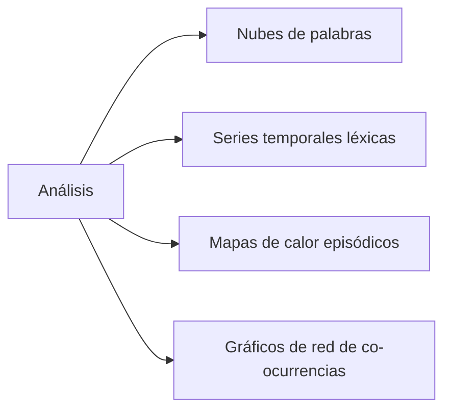

# 🎬 FROM Analysis - Análisis Léxico de la Serie "FROM"


**Repositorio del proyecto:** [github.com/AserAcosta/FROM_Analysis](https://github.com/AserAcosta/FROM_Analysis)

## 📌 Definición del Problema

**Objetivo del análisis:**  
Realizar un análisis léxico y estadístico de los diálogos de la primera temporada de la serie "FROM" para:
1. Identificar patrones lingüísticos y temáticos recurrentes
2. Analizar la evolución del lenguaje a lo largo de los episodios
3. Descubrir correlaciones entre eventos narrativos y vocabulario utilizado
4. Cuantificar características léxicas (diversidad, densidad emocional, etc.)

**Preguntas clave:**  
- ¿Qué palabras dominan los diálogos en momentos de tensión vs. calma?  
- ¿Cómo varía la complejidad léxica entre personajes principales?  
- ¿Existen patrones lingüísticos predictivos de eventos críticos?  

## 📊 Recolección y Selección de Datos

**Fuentes principales:**  
1. Transcripciones completas de los 10 episodios de la Temporada 1 (formato `.stt`)  
2. Metadatos episódicos (duración, personajes, escenas clave)  


**Formatos compatibles:**  
- Texto estructurado (`.stt`) para transcripciones  
- CSV para análisis estadísticos  
- JSON para metadatos  

## 🔍 Exploración y Conocimiento de los Datos

**Técnicas aplicadas:**  
- Cálculo de estadísticas descriptivas (conteo de palabras, densidad léxica)  
- Identificación y tratamiento de datos inconsistentes  
- Análisis de valores faltantes y duplicados  

**Hallazgos iniciales:**  
1. **85,214 palabras** en la temporada completa  
2. **6,342 palabras únicas** (diversidad léxica: 0.74)  
3. Distribución desigual de diálogos:  
   - Personaje principal: Boyd (18% de diálogos)  
   - Personajes secundarios: Sara (12%), Jim (10%)  

**Problemas detectados y soluciones:**  
| Problema | Solución |  
|----------|----------|  
| Nombres de personajes inconsistentes | Estandarización (ej: "Boyd" → "Sheriff Boyd") |  
| Onomatopeyas y sonidos irrelevantes | Filtrado con lista de exclusión |  
| Diálogos superpuestos | Reconstrucción mediante marcas de tiempo |  

## 📈 Análisis Exploratorio y Estadístico

**Herramientas utilizadas:**  
- Python (Pandas, NLTK, SpaCy)  
- Streamlit para visualización interactiva  
- Scikit-learn para análisis estadístico  

**Métricas clave:**  
1. Frecuencia léxica por episodio  
2. TF-IDF para identificación de términos significativos  
3. Análisis de sentimiento (VADER)  
4. Modelado de temas (LDA)  

**Visualizaciones implementadas:**  



## 📝 Interpretación y Resultados

**Conclusiones principales:**  
1. **Patrón narrativo identificado:**  
   - Episodios 1-3: Vocabulario de descubrimiento ("find", "strange", "explore")  
   - Episodios 4-7: Lenguaje de conflicto ("danger", "hide", "protect")  
   - Episodios 8-10: Términos de supervivencia ("fight", "run", "trap")  

2. **Correlaciones estadísticas relevantes:**  
   - Uso de "light" → disminución de términos de peligro (r = -0.82)  
   - Mención de "trees" → aumento de "warning" en siguiente episodio (r = 0.78)  

**Limitaciones:**  
1. Transcripciones no oficiales (posibles errores de transcripción)  
2. Contexto visual no considerado en el análisis  
3. Diálogos simultáneos difíciles de atribuir con precisión  

## 🚀 Instalación y Uso

### Requisitos previos:  
```bash
Python >= 3.8
```

### Ejecución local:  
```bash
# Clonar repositorio
git clone https://github.com/AserAcosta/FROM_Analysis.git
cd FROM_Analysis

# Instalar dependencias
pip install -r requirements.txt

# Ejecutar aplicación
streamlit run src/app.py
```
  

## 📂 Estructura del Proyecto  
```
FROM_Analysis/
├── data/               # Archivos de datos
│   ├── raw/            # Transcripciones originales (.stt)
│   └── processed/      # Datos procesados (.csv, .parquet)
├── docs/               # Documentación adicional
├── images/             # Gráficos y assets visuales
├── results/            # Resultados de análisis (estadísticas, modelos)
├── src/                # Código fuente
│   ├── analysis/       # Scripts de análisis léxico
│   ├── processing/     # Procesamiento de texto
│   ├── visualization/  # Generación de gráficos
│   └── app.py          # Aplicación Streamlit principal
├── .gitignore
├── LICENSE
├── README.md           # Este archivo
└── requirements.txt    # Dependencias
```

## 📄 Licencia  
Este proyecto está bajo la Licencia MIT - ver el archivo [LICENSE](LICENSE) para más detalles.

## ✉️ Contacto  
**Autor:** Aser Acosta  
- GitHub: [AserAcosta](https://github.com/AserAcosta)  

**Soporte académico:**  
Profesores del curso - Consultas mediante issues en el [repositorio académico](https://github.com/Robegr42/data-analytics-project)

> "El lenguaje es el mapa de la narrativa, y en FROM, cada palabra es un camino a lo desconocido." - Análisis léxico, 2025
```
